# My NIT App

## Intro
Thought of building & deploying this app for my College (NIT Andhra Pradesh).  
However this project couldn't takeoff back then, so I wish to opensource.

## Techstack
- [Flutter](https://flutter.dev/)
- [Firebase](https://firebase.google.com/docs/flutter/setup)
  - Authentication (Email must be enabled)
  - Realtime Database (This needs to be intialized with students basic details. Refer below)
  - Firestore
  - Storage

 

## Screenshots
|                Login Page                 |                  Student Signup                   |                  Student Login                  |
| :---------------------------------------: | :-----------------------------------------------: | :---------------------------------------------: |
| 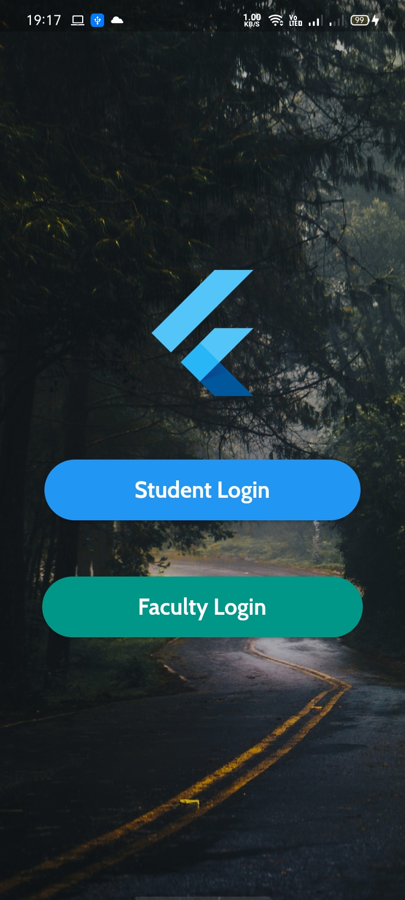 | 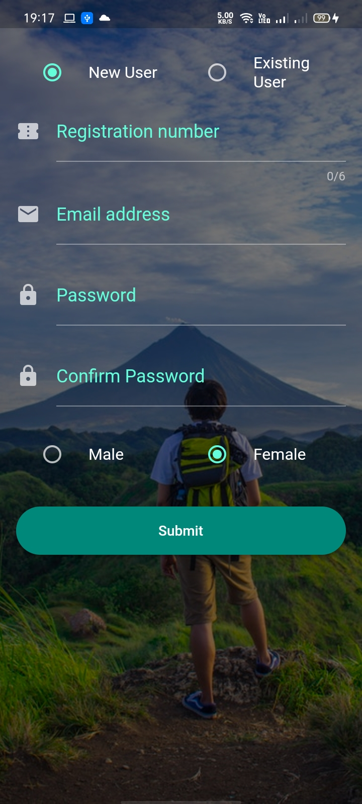 | 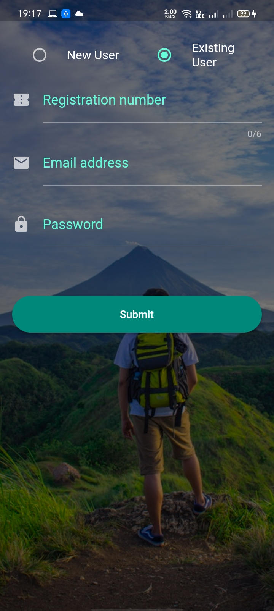 |

 

|                      SignUp                      |                     Annoncements Page                      | Blog Page                                |
| :----------------------------------------------: | :--------------------------------------------------------: | :--------------------------------------- |
| 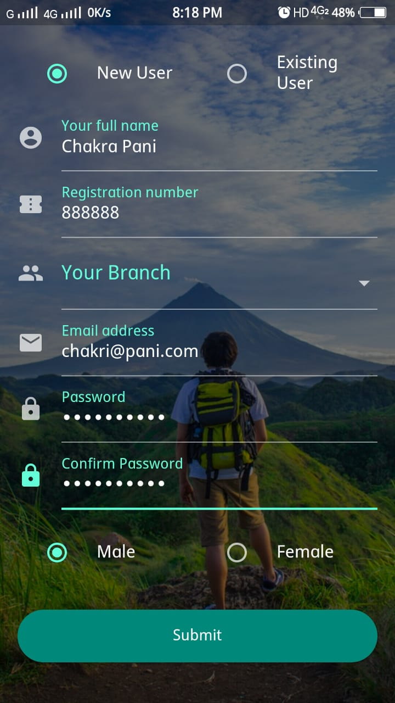 |  | 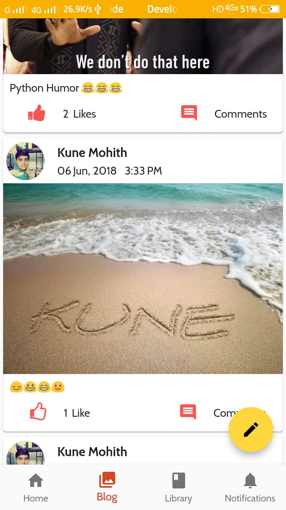 |

 

|               Add Post                |                 Profile Create                  |
| :-----------------------------------: | :---------------------------------------------: |
| 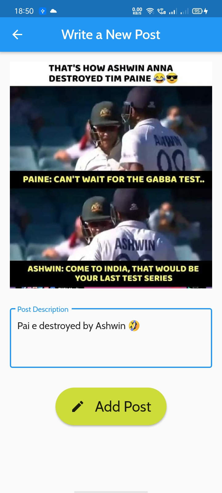 | 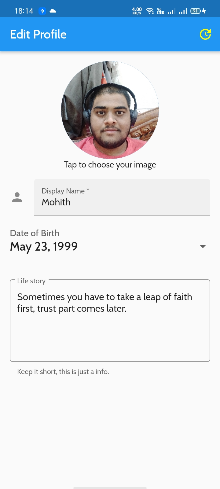 |

 

|                Nav Drawer                 |                Nav Drawer(Dark Mode)                |
| :---------------------------------------: | :-------------------------------------------------: |
| 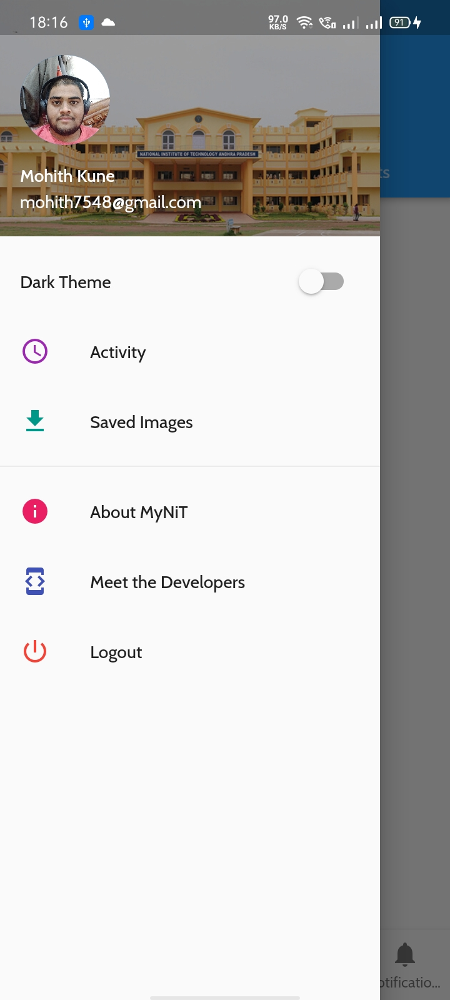 | 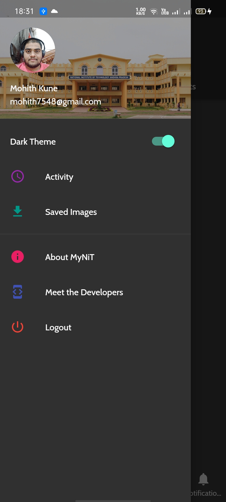 |

 

|             About Page 1             |               About Page 2               |
| :----------------------------------: | :--------------------------------------: |
| 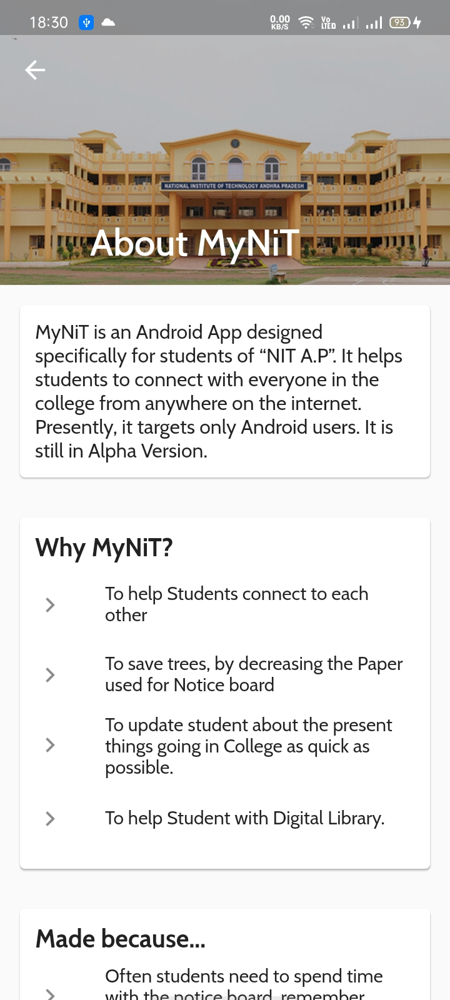 | 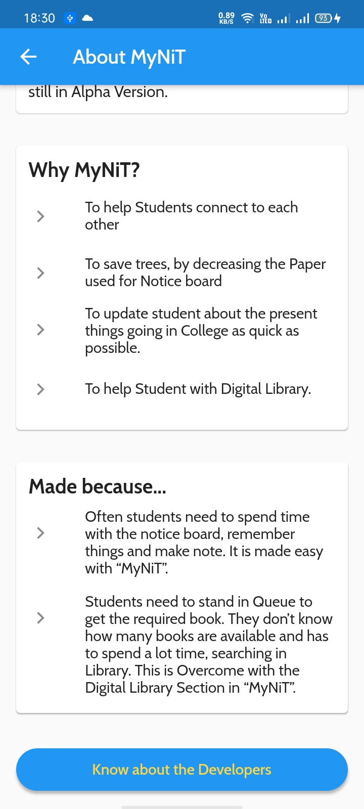 |

 

|                Activity                |                  Saved Images                  |
| :------------------------------------: | :--------------------------------------------: |
| 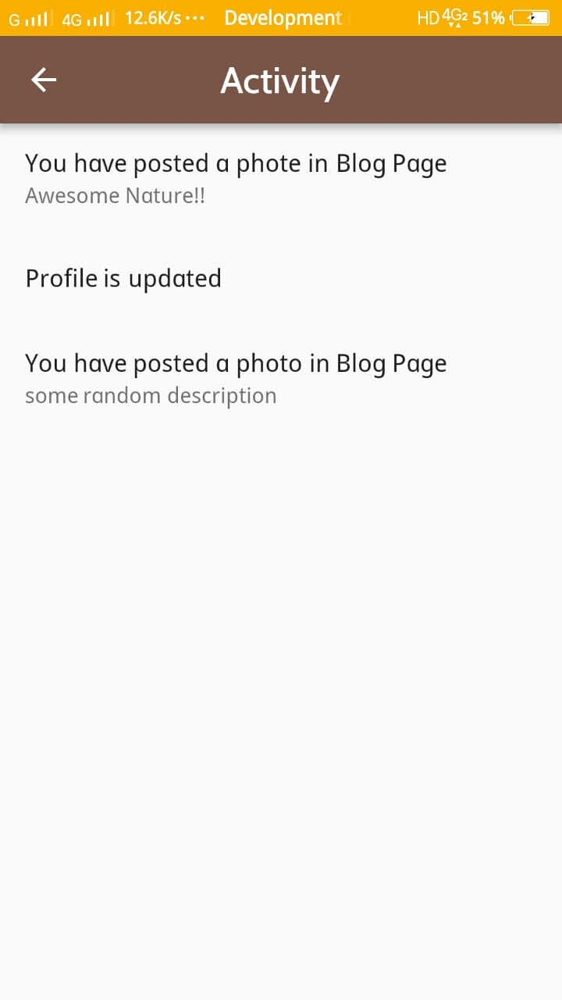 | 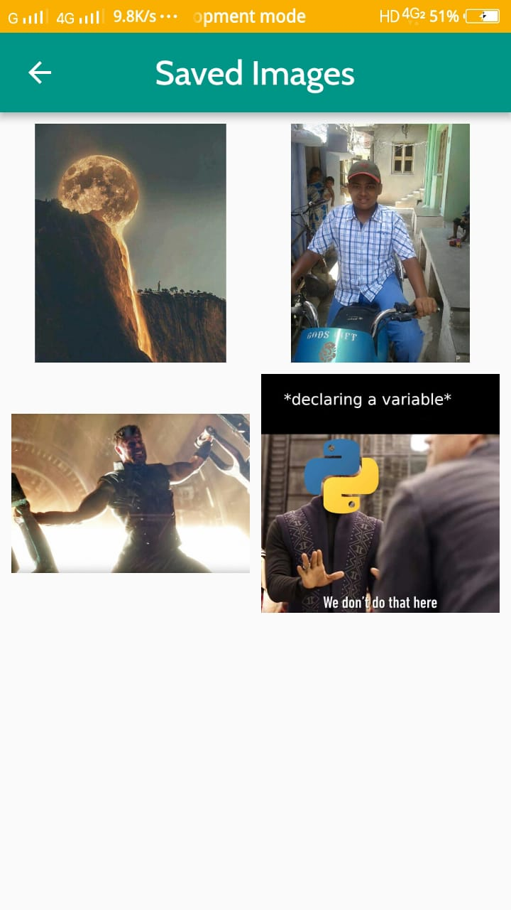 |

 

|             Developers Page             |                 Developer View                  |
| :-------------------------------------: | :---------------------------------------------: |
| 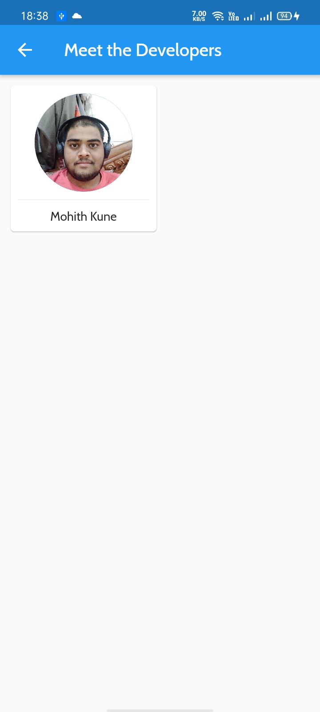 |  |

 

|               Profile Page                |                 Logout                  |
| :---------------------------------------: | :-------------------------------------: |
| 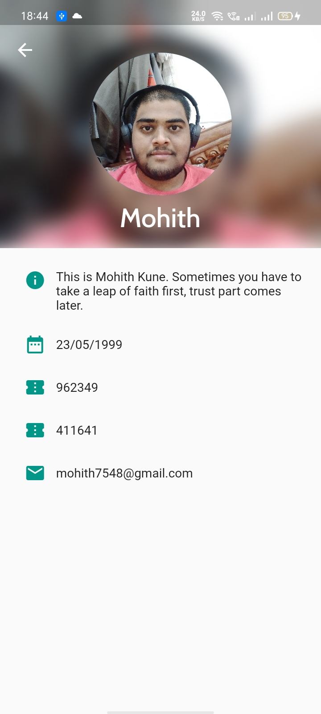 | 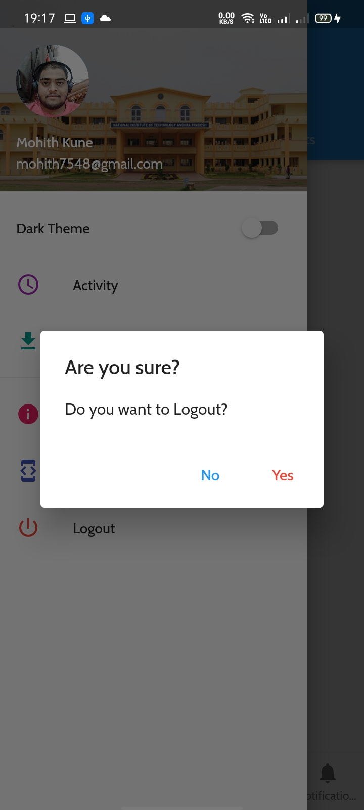 |

 

Firebase Realtime DB(This must be populated with students basic details)
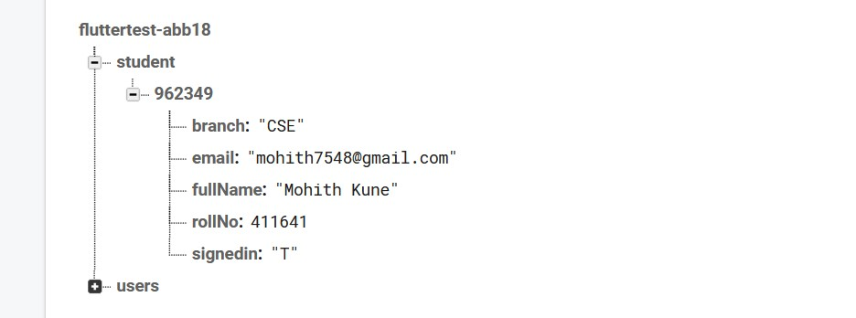

 

Firebase Firestore
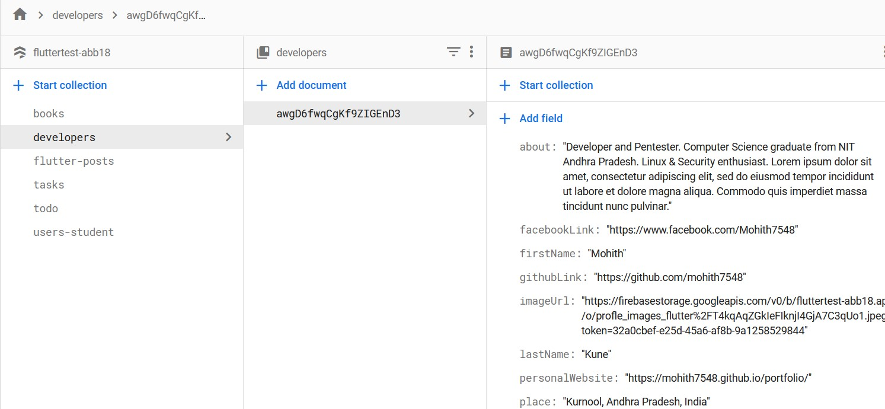

 

## Getting Started

This project is a starting point for a Flutter application.

A few resources to get you started if this is your first Flutter project:

- [Lab: Write your first Flutter app](https://flutter.io/docs/get-started/codelab)
- [Cookbook: Useful Flutter samples](https://flutter.io/docs/cookbook)

For help getting started with Flutter, view our 
[online documentation](https://flutter.io/docs), which offers tutorials, 
samples, guidance on mobile development, and a full API reference.

**NOTE :**
The Flutter application is created using an older version of the Android
embedding. It's being deprecated in favor of Android embedding v2. Follow the
steps at
https://flutter.dev/go/android-project-migration
to migrate the project.